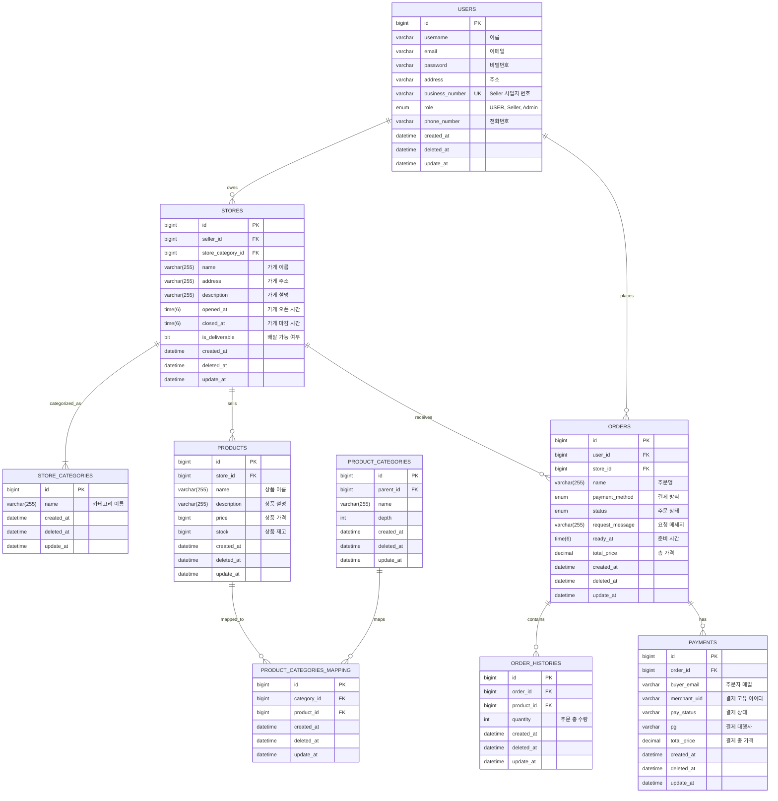

# BuyHood 

 

# 목차

- [프로젝트 소개](#프로젝트-소개)
- [팀원 소개 및 역할](#팀원-소개-및-역할)
- [주요 기능](#주요-기능)
- [ERD](#erd)
- [API 명세서](#api-명세서)
- [인프라 아키텍처 & 기술 스택](#인프라-아키텍처--기술-스택)
- [성과 및 회고](#성과-및-회고)

 

## 프로젝트 소개
### 📅 프로젝트 기간: 2025/05/26 ~ 2025/06/15

> 📌 **지역 기반 맞춤 상품을 빠르고 편리하게 구매하는 이커머스 서비스**

- 지역 기반 추천으로 내 주변에서 판매 중인 다양한 상품을 한눈에 확인할 수 있습니다. 

- 거주하는 동네의 상점과 소상공인과 직접 연결해 지역 경제 활성화를 돕는 것이 목표입니다.

- 지역 화폐 결제 시스템을 도입해 지역 내 소비를 촉진하고, 빠른 배송으로 편리한 쇼핑 경험을 제공합니다.

 

## 팀원 소개 및 역할

| 김기홍  🔗 [Github](https://github.com/KimKiHong-1111) | 문성준    🔗 [Github](https://github.com/sjMun09) | 박용준 🔗[ Github](https://github.com/dereck-jun)           | 서지원   🔗 [Github](https://github.com/jiwonclvl)      |
|-----------------------------------------------------|------------------------------------------------|----------------------------------------------------------|------------|
| **JWT 기반 인증/인가** **회원 기능** | **CI/CD 배포**  **카트 모듈 분리**                      | **가게**   **상품**    **가게 및 상품 카테고리**   **검색 기능** | **카트**   **주문**    **결제**

 

## 주요 기능

🪪 <strong>JWT 기반 인증/인가</strong>

- JWT를 활용해 사용자 인증 및 권한 인가를 처리합니다.
- 사용자 역할 기반 권한 제어 (USER, SELLER, ADMIN)

🔎 <strong>최적의 검색을 통한 상품 및 가게 추천?</strong>

🛒 <strong>주문 및 결제 처리</strong>

**[장바구니]**
- 장바구니에서 상품 추가

**[주문]**

- 주문 상태: `PENDING` ➡️ `ACCEPTED (가게 승인)` ➡️ `COMPLETED` (취소시 **CANCELED**, 가게 거절 시 **REJECTED** )
 

**[결제]**

- 결제 상태: `READY` ➡️ `PAID` (실패시 **FAILED** , 취소시 **CANCELED** )

- 결제 수단으로는 **CARD**, **ZERO_PAY** 등을 지원하며, Iamport 결제 모듈을 연동
- **결제 성공** 시 <ins>결제 상태 업데이트</ins>, **실패** 시 <ins>주문 PENDING 상태</ins>
- ZERO_PAY는 QR 코드 생성을 통해 모의 결제 시뮬레이션을 지원

 

## ERD

 

## API 명세서

추가 

 

## 인프라 아키텍처 & 기술 스택

### 인프라 아키텍처

 

### 🛠️ Skills

  
  
  
  
  
  
   
  
  
  
  

 

## 성과 및 회고

### 성과

 

### 보안점

