# BuyHood 

# 목차

- [프로젝트 소개](#프로젝트-소개)
- [팀원 소개 및 역할](#팀원-소개-및-역할)
- [주요 기능](#주요-기능)
- [ERD](#erd)
- [API 명세서](#api-명세서)
- [인프라 아키텍처 & 기술 스택](#인프라-아키텍처--기술-스택)
- [패키지 구조](#패키지-구조)
- [성과 및 회고](#성과-및-회고)

<br>

## 프로젝트 소개
### 📅 프로젝트 기간: 2025/05/26 ~ 2025/06/15

> 📌 **각 지역화폐의 사용 가능 지역을 기반으로 내 주변 상점의 상품을 확인하고 구매할 수 있는 지역 기반 이커머스 플랫폼**

<br>

### 주요 특징

- **지역 기반 상품 확인**

    내 주변에서 판매 중인 다양한 상품을 한눈에 확인할 수 있습니다.


- **빠른 배송 & 픽업**

    가까운 지역 상점에서 주문하기 때문에 빠른 배송은 물론, 직접 픽업도 가능합니다.


- **지역 화폐 결제 지원**

    각 지역화폐로 결제 가능하여, 더욱 편리한 소비 환경을 제공합니다.


- **지역 경제 활성화 기여**

    거주 지역의 상점 및 소상공인과 직접 연결되어, 지역 내 소비를 촉진합니다.


<br>

## 팀원 소개 및 역할


| 김기홍  🔗 [Github](https://github.com/KimKiHong-1111) | 문성준    🔗 [Github](https://github.com/sjMun09) | 박용준 🔗[ Github](https://github.com/dereck-jun)           | 서지원   🔗 [Github](https://github.com/jiwonclvl)      |
|-----------------------------------------------------|------------------------------------------------|----------------------------------------------------------|------------|
| **JWT 기반 인증/인가**<br>**회원 기능** | **CI/CD 배포**<br> **카트 모듈 분리**                      | **가게** <br> **상품**  <br> **가게 및 상품 카테고리** <br> **검색 기능** | **카트** <br> **주문**  <br> **결제**

<br>

## 주요 기능


<details>
<summary>🪪 <strong>JWT 기반 인증/인가</strong></summary>

- JWT를 활용해 사용자 인증 및 권한 인가를 처리합니다.
- 사용자 역할 기반 권한 제어 (USER, SELLER, ADMIN)


</details>

<details>
<summary>🔎 <strong>최적의 검색을 통한 상품 및 가게 추천?</strong></summary>


</details>

<details>
<summary>🛒 <strong>주문 및 결제 처리</strong></summary>

**[장바구니]**
- 장바구니에서 상품 추가

**[주문]**

- 주문 상태: `PENDING` ➡️ `ACCEPTED (가게 승인)` ➡️ `COMPLETED` (취소시 **CANCELED**, 가게 거절 시 **REJECTED** )
 

**[결제]**

- 결제 상태: `READY` ➡️ `PAID` (실패시 **FAILED** , 취소시 **CANCELED** )


- 결제 수단으로는 **CARD**, **ZERO_PAY** 등을 지원하며, Iamport 결제 모듈을 연동
- **결제 성공** 시 <ins>결제 상태 업데이트</ins>, **실패** 시 <ins>주문 PENDING 상태</ins>
- ZERO_PAY는 QR 코드 생성을 통해 모의 결제 시뮬레이션을 지원

</details>


<br>

## ERD

```mermaid
erDiagram
    USERS ||--o{ STORES : owns
    USERS {
    bigint id PK
    varchar username "이름"
    varchar email "이메일"
    varchar password "비밀번호"
    varchar address "주소"
    varchar business_number UK "Seller 사업자 번호"
    enum role "USER, Seller, Admin"
    varchar phone_number "전화번호"
    datetime created_at 
    datetime deleted_at
    datetime update_at
    }

    STORES ||--|{ STORE_CATEGORIES : categorized_as
    STORES ||--o{ PRODUCTS : sells
    STORES {
        bigint id PK
        bigint seller_id FK 
        bigint store_category_id FK
        varchar(255) name "가게 이름"
        varchar(255) address "가게 주소"
        varchar(255) description "가게 설명"
        time(6) opened_at "가게 오픈 시간"
        time(6) closed_at "가게 마감 시간"
        bit is_deliverable "배달 가능 여부"
        datetime created_at
        datetime deleted_at
        datetime update_at
    }

    STORE_CATEGORIES {
        bigint id PK
        varchar(255) name "카테고리 이름"
        datetime created_at
        datetime deleted_at
        datetime update_at
    }

    PRODUCT_CATEGORIES ||--o{ PRODUCT_CATEGORIES_MAPPING : maps
    PRODUCTS ||--o{ PRODUCT_CATEGORIES_MAPPING : mapped_to
    PRODUCT_CATEGORIES {
        bigint id PK
        bigint parent_id FK 
        varchar(255) name
        int depth 
        datetime created_at
        datetime deleted_at
        datetime update_at
    }

    PRODUCT_CATEGORIES_MAPPING {
        bigint id PK
        bigint category_id FK
        bigint product_id FK
        datetime created_at
        datetime deleted_at
        datetime update_at
    }

    PRODUCTS {
        bigint id PK
        bigint store_id FK
        varchar(255) name "상품 이름"
        varchar(255) description "상품 설명"
        bigint price "상품 가격"
        bigint stock "상품 재고"
        datetime created_at
        datetime deleted_at
        datetime update_at
    }

    USERS ||--o{ ORDERS : places
    STORES ||--o{ ORDERS : receives
    ORDERS ||--o{ ORDER_HISTORIES : contains
    ORDERS ||--o{ PAYMENTS : has
    ORDERS {
        bigint id PK
        bigint user_id FK
        bigint store_id FK
        varchar(255) name "주문명"
        enum payment_method "결제 방식"
        enum status "주문 상태"
        varchar(255) request_message "요청 메세지"
        time(6) ready_at "준비 시간"
        decimal total_price "총 가격"
        datetime created_at
        datetime deleted_at
        datetime update_at
    }

    ORDER_HISTORIES {
        bigint id PK
        bigint order_id FK 
        bigint product_id FK 
        int quantity "주문 총 수량"
        datetime created_at
        datetime deleted_at
        datetime update_at
    }

    PAYMENTS {
        bigint id PK
        bigint order_id FK
        varchar buyer_email "주문자 메일"
        varchar merchant_uid "결제 고유 아이디"
        varchar pay_status "결제 상태"
        varchar pg "결제 대행사"
        decimal total_price "결제 총 가격"
        datetime created_at
        datetime deleted_at
        datetime update_at
    }
```


<br>

## API 명세서

추가 

<br>

## 인프라 아키텍처 & 기술 스택

### 인프라 아키텍처


<br>

### 🛠️ Skills
<p align="left">
  
  
  
  
  
  
  <br/>
  
  
  
  
</p>

<br>

## 패키지 구조
- **마이크로서비스 아키텍처(MSA)를 기반**으로 구성된 커머스 플랫폼
- 각 도메인은 독립적인 모듈로 분리되어 있rh 공통 기능과 인프라는 글로벌 모듈에서 관리

<br>

###  모듈 설명

| 모듈명 | 설명 |
|------|------|
| **apigateway** | 클라이언트 요청을 각 마이크로서비스로 전달하는 API 게이트웨이 |
| **eureka** | 서비스 등록 및 검색을 위한 서비스 디스커버리 서버 |
| **buyhood-global-core** | 공통 설정, 예외 처리, Feign 클라이언트 등 글로벌 컴포넌트 |
| **auth** | 인증 및 인가 처리 (로그인, 토큰 발급 등) |
| **user** | 사용자 정보 및 계정 관리 기능 |
| **buyhood-category** | 상품 및 매장 카테고리 도메인으로 분리되어 구성 |
| **store** | 매장 및 판매자 관련 기능 |
| **product** | 상품 등록, 조회, 수정 등 상품 도메인 로직 |
| **cart** | 장바구니 도메인 (상품 담기, 수량 변경, 삭제 등) |
| **order** | 주문 처리 및 주문 상태 관리 |
| **payment** | 결제 요청, 결제 상태 관리 |

<br>

### 구조
<details>
<summary> 🧩<strong>구조 확인하기</strong></summary>

```
api.buyhood
├── apigateway
│   ├── BuyhoodApiGatewayApplication.java
│   ├── filter
│   └── route
│
├── eureka
│   └── BuyhoodEurekaApplication.java
│
├── buyhood-global-core
│   ├── buyhood-global-common
│   │   ├── enums
│   │   ├── errorcode
│   │   ├── exception
│   │   ├── dto
│   │   └── entity
│   │
│   ├── buyhood-global-config
│   │   ├── config
│   │   ├── filter
│   │   ├── handler
│   │   └── security
│   │
│   └── buyhood-global-feign
│   ├── client
│   └── dto
│
├── auth
│   ├── BuyhoodDomainAuthApplication.java
│   ├── controller
│   ├── service
│   └── dto
│
├── user
│   ├── BuyhoodDomainUserApplication.java
│   ├── controller
│   ├── service
│   ├── repository
│   ├── dto
│   └── entity
│
├── buyhood-category
│   ├── buyhood-product-category
│   │   ├── BuyhoodProductCategoryApplication.java
│   │   ├── controller
│   │   ├── service
│   │   ├── repository
│   │   ├── dto
│   │   └── entity
│   │
│   └── buyhood-store-category
│   ├── BuyhoodStoreCategoryApplication.java
│   ├── controller
│   ├── service
│   ├── repository
│   ├── dto
│   └── entity
│
├── product
│   ├── BuyhoodProductApplication.java
│   ├── client
│   ├── controller
│   ├── service
│   ├── repository
│   ├── dto
│   └── entity
│
├── store
│   ├── BuyhoodStoreApplication.java
│   ├── client
│   ├── controller
│   ├── service
│   ├── repository
│   ├── dto
│   └── entity
│
├── cart
│   ├── BuyhoodCartApplication.java
│   ├── client
│   ├── controller
│   └── service
│
├── order
│   ├── BuyhoodOrderApplication.java
│   ├── client
│   ├── controller
│   ├── service
│   ├── repository
│   ├── dto
│   ├── entity
│   └── enums
│
└── payment
│   ├── BuyhoodPaymentApplication.java
│   ├── client
│   ├── controller
│   ├── service
│   ├── repository
│   ├── dto
│   ├── entity
│   └── enums
```


</details>


<br>

## 성과 및 회고

### 성과


<br>

### 보완점


